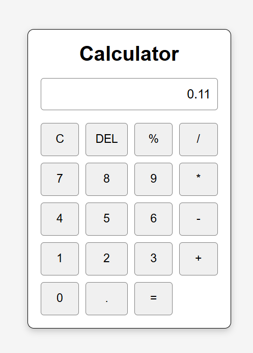

# Calculator

## Description
A simple and responsive Calculator developed using HTML, CSS, and JavaScript. It performs basic arithmetic operations with a clean and user-friendly interface.

## Features
- Addition
- Subtraction
- Multiplication
- Division
- Percentage
- Decimal calculations
- Clear (C) button
- Delete (DEL) button
- Responsive design

## Technologies Used
- HTML5
- CSS3
- JavaScript

## Project Structure
calculator/
├── index.html
├── style.css
├── script.js
├── calculator.png
└── README.md

## Live Demo
https://ds13032905-a11y.github.io/OIBSIP/calculator/

## Screenshot

